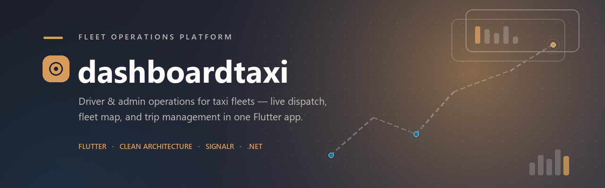
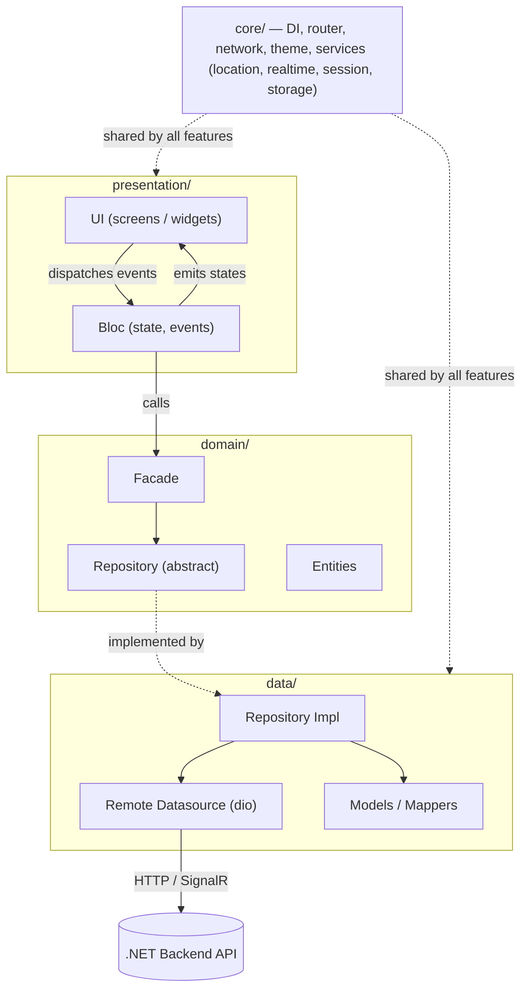

<div align="center">
  
</div>

<div align="center">

# dashboardtaxi

**A hybrid driver &amp; admin operations app for taxi/ride-hailing fleets, built with Flutter.**

<p>
  <a href="https://flutter.dev"></a>
  <a href="https://dart.dev"></a>
  <a href="#getting-started"></a>
</p>
<p>
  <a href="#architecture"></a>
  <a href="#license"></a>
</p>

</div>

<div align="center">

**[Overview](#overview) · [Features](#features) · [Tech Stack](#tech-stack) · [Architecture](#architecture) · [Project Structure](#project-structure) · [Getting Started](#getting-started) · [Languages](#supported-languages) · [CI/CD](#cicd)**

</div>

---

## Overview

**dashboardtaxi** is a single Flutter codebase that serves two roles in a taxi/ride-hailing platform:

- **Drivers** — go online, receive dispatches, and execute trips end-to-end.
- **Admins / dispatchers** — monitor the live fleet, assign trips (manually or automatically), review driver KYC documents, manage refunds and compensation claims, and configure platform-wide settings.

The app determines the active role after login and renders a role-aware shell — drivers get a trip-execution workspace with online/offline controls, while admins get a dashboard shell with a fleet map, dispatch tools, and operations screens. An admin with a linked driver profile can even self-assign a trip, and the app hands off from admin mode into the driver trip-execution flow in place.

It talks to a **.NET backend** over a REST API for CRUD/business operations and **SignalR** for realtime events (trip lifecycle, live driver locations, refund status changes, chat).

---

## Features

<table>
<tr>
<td width="34%" valign="top">

### 🚖 Driver

- **Live map & trip execution** — full-screen map, cinematic camera recentering, online/offline toggle, and a staged trip sheet (incoming → to-pickup → at-pickup → in-progress → summary)
- **In-trip chat** with the passenger
- **KYC document submission** for driver approval
- **Compensation claims** for eligible trip issues
- **Push & local notifications** for dispatch and account events

</td>
<td width="34%" valign="top">

### 🧭 Admin / Dispatch

- **Live fleet map** — realtime driver locations over SignalR, color-coded by status
- **Control Center** — fleet & pricing configuration (vehicle types, trip pricing)
- **Dashboard overview** — KPIs (trips, active drivers, revenue) with pull-to-refresh
- **Trip management** — filterable list, manual assignment, admin self-assignment ("take trip")
- **Driver management** — approve/suspend, review & approve/reject KYC, assign vehicle types
- **Customer records** & **incident tracking** with detail views
- **In-trip safety recordings** playback
- **Refund lifecycle management** — Stripe-backed retry, live-updated via SignalR (`RefundLifecycleChanged`, `RefundIssueCreated`)
- **Refund request review** queue
- **Admin management** — create additional admin accounts
- **App version config** — remotely configure min/latest supported app versions per platform
- **Audit logs**, system settings (trip discount %, currency), role-gated navigation drawer

</td>
<td width="32%" valign="top">

### 🔗 Shared

- **Auth** — JWT session handling, forced password reset, role-based routing guards
- **9-language localization** with in-app switcher
- **Light / dark theming**
- **In-app** Privacy Policy & Terms of Service

</td>
</tr>
</table>

---

## Tech Stack

| Layer | Tools |
|---|---|
| **Framework** | Flutter (Dart ≥ 3.10) |
| **State management** | `flutter_bloc` / `bloc` |
| **Dependency injection** | `get_it` + `injectable` |
| **Routing** | `go_router` (role-aware guards) |
| **Networking** | `dio` (+ `dio_refresh_bot` for token refresh), TLS certificate pinning via `crypto` SHA-256 fingerprints |
| **Realtime** | `signalr_netcore` |
| **Maps & location** | `google_maps_flutter`, `geolocator`, `flutter_polyline_points` |
| **Auth & push** | `firebase_auth`, `firebase_messaging`, `firebase_core`, `flutter_local_notifications` |
| **Local persistence** | `objectbox` (local cache), `flutter_secure_storage` (tokens), `shared_preferences` |
| **Forms** | `reactive_forms` |
| **Localization** | `easy_localization` (9 locales) |
| **Codegen** | `build_runner`, `freezed`, `injectable_generator`, `objectbox_generator`, `flutter_gen_runner` |
| **Media** | `image_picker`, `audioplayers`, `cached_network_image` |

---

## Architecture

The app follows **Clean Architecture** with a feature-first module layout. Each entry under `lib/features/` is independently structured into `data` → `domain` → `presentation` layers, wired together through a facade and DI container:



| Layer | Responsibility |
|---|---|
| **`presentation`** | Blocs (`flutter_bloc`), screens, and widgets. Blocs depend only on domain facades, never on data-layer types. |
| **`domain`** | Framework-agnostic entities, repository interfaces, and a facade that the presentation layer calls into. |
| **`data`** | Repository implementations, remote datasources (`dio`), and models/mappers that convert API payloads into domain entities. |
| **`core`** | Cross-cutting concerns shared by every feature: DI setup (`injectable`/`get_it`), `go_router` route guards, the `dio` network client (with certificate pinning and token refresh), theming, and services such as location tracking, the SignalR realtime client, session/auth management, and local storage. |

---

## Project Structure

<details>
<summary><b>Expand full <code>lib/</code> tree</b></summary>

```text
lib/
├── main.dart               # Entry point (flavor bootstrap)
├── app.dart                 # MaterialApp / router / localization wiring
├── bootstrap.dart            # DI + Firebase + service initialization
├── flavors.dart               # Flavor enum (stage / production)
├── common/                     # Shared cross-feature widgets
├── core/
│   ├── config/                   # App + localization config
│   ├── injection/                 # get_it / injectable setup
│   ├── network/                     # Dio client, interceptors, cert pinning
│   ├── router/                       # go_router config + auth/role guards
│   ├── services/                      # location, realtime (SignalR), session, storage, permissions...
│   ├── theme/                          # Colors, text styles, light/dark themes
│   └── domain/                          # Shared entities/extensions (e.g. user role)
├── features/
│   ├── auth/                    # Driver + admin login, password reset
│   ├── root/                    # App shell: bottom nav, drawer, routing hub
│   ├── driver_home/              # Driver home tab (map + online/offline controls)
│   ├── trip/                      # Trip execution (driver) & trip detail (admin)
│   ├── chat/                       # In-trip chat
│   ├── dashboard/                   # Admin KPI overview, trips list, live fleet map
│   ├── control_center/               # Fleet & pricing configuration
│   ├── admin_management/              # Create/manage admin accounts
│   ├── customers/                      # Customer records
│   ├── customer_incidents/              # Incident tracking
│   ├── compensation/                     # Compensation claims
│   ├── refunds/ · refund_requests/        # Refund lifecycle & request review
│   ├── recordings/                         # In-trip safety recordings
│   ├── kyc/                                 # Driver document verification
│   ├── app_version_config/                   # Remote min/latest app version config
│   ├── notifications/                          # Push notification sending/handling
│   ├── profile/, company_contact/, support_contact/, permissions/, splash/
└── utils/                    # Generated assets (flutter_gen), helpers
```

</details>

---

## Getting Started

### Prerequisites
- Flutter SDK (Dart ≥ 3.10 — see `codemagic.yaml`, built against Flutter 3.44)
- A Firebase project (`firebase_options.dart` is generated via FlutterFire CLI)
- A Google Maps API key
- Xcode (iOS, deployment target 13.0+) and/or Android Studio (Android)

### Setup

```bash
# 1. Install dependencies
flutter pub get

# 2. Configure environment
cp .env.example .env
# then fill in:
#   GOOGLE_MAPS_API_KEY
#   STAGE_BASE_URL
#   PRODUCTION_BASE_URL

# 3. Generate code (DI, freezed models, ObjectBox, localized strings)
dart run build_runner build --delete-conflicting-outputs

# 4. Run
flutter run --flavor stage -t lib/main.dart
```

### Flavors

The app ships two flavors (configured via `flutter_flavorizr`), both bootstrapping from `lib/main.dart`:

```bash
# Stage
flutter run --flavor stage -t lib/main.dart

# Production
flutter run --flavor production -t lib/main.dart
```

### Code generation cheatsheet

| Task | Command |
|---|---|
| Full codegen (DI, freezed, ObjectBox, assets) | `dart run build_runner build --delete-conflicting-outputs` |
| Regenerate localized app strings | `dart run tool/generate_app_strings.dart` |

---

## Supported Languages

The app ships with 9 in-app locales:

🇬🇧 English · 🇸🇦 Arabic · 🇩🇪 German · 🇪🇸 Spanish · 🇫🇷 French · 🇳🇱 Dutch · 🇵🇱 Polish · 🇷🇴 Romanian · 🇺🇦 Ukrainian

---

## CI/CD

Android production builds (signed, obfuscated APK) are automated via **Codemagic** (`codemagic.yaml`).

---

## Contributing

This is currently a closed-source, single-maintainer project. Issues and pull requests are welcome for discussion, but please open an issue before submitting substantial changes.

## License

No license file is currently published in this repository — all rights reserved by default. Contact the maintainer if you need usage terms clarified.

---

<div align="center">

Built by [Fat7i](https://github.com/fat7i-alghareeb)

[⬆ Back to top](#dashboardtaxi)

</div>
