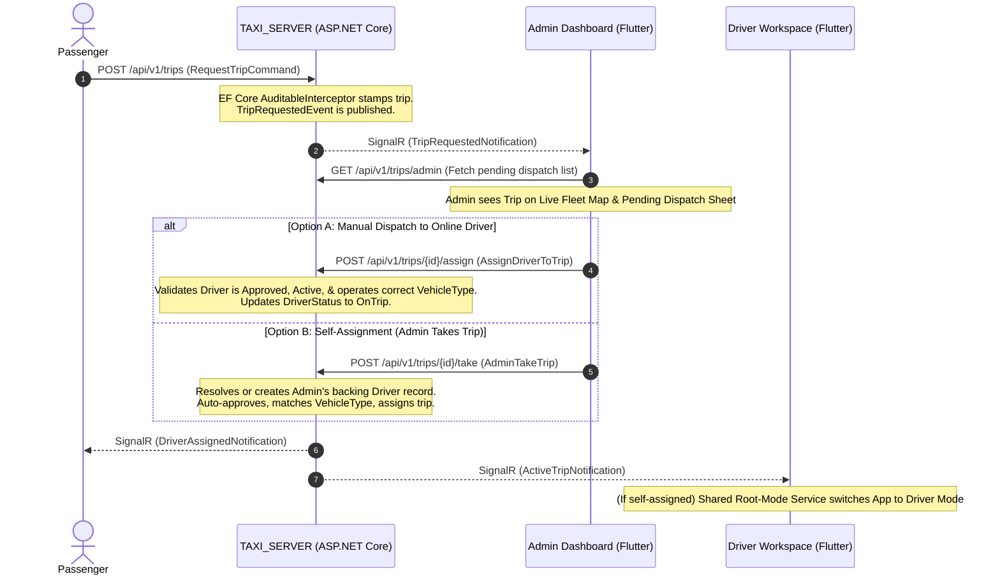

# 🚕 Trip Arrival & Dispatch Architecture: Admin Flow & Backend Integration

This document outlines the detailed end-to-end flow when a new trip requested by a passenger arrives at the platform, explaining what the **Admin** sees and does on the Dashboard app (`dashboardtaxi`) and how the **Backend** (`TAXI_SERVER`) orchestrates it under the hood.

---

## 🏛️ Flow Overview Diagram

---

## 1. Under the Hood: Trip Request Arrival (Backend `TAXI_SERVER`)

When a passenger requests a trip, the backend processes the request via **MediatR** using a vertical slice:

1. **REST Entry Point**: `POST /api/v1/trips` triggers the `RequestTripCommand`.
2. **Validation Pipeline**: The `ValidationBehavior` intercepts the request and runs `RequestTripCommandValidator` via FluentValidation to verify pickup/destination coordinates, pricing quote validity, and passenger authentication status.
3. **Database Insertion & Audit**: The command handler saves the trip in a `PendingQuote` or `Requested` status.
   * EF Core's `AuditableEntityInterceptor` automatically stamps the creation timestamps (`CreatedAtUtc`) and passenger IDs.
   * `AuditLogInterceptor` records the transaction logs natively.
4. **Realtime Broadcast**: 
   * Before committing, a domain event `TripRequestedEvent` is queued on the `Trip` aggregate.
   * Upon database save, the event is intercepted and dispatched via `TripRequestedEventHandler`.
   * This handler calls `ITripNotifier` (implemented by `SignalRTripNotifier`), which broadcasts a strong-typed `TripRequestedNotification` via **SignalR (`TripHub`)** to the admin socket group and nearby drivers.

---

## 2. Visual Layer: What the Admin Sees (Flutter Dashboard)

On the **Admin Dashboard** of the `dashboardtaxi` app, the arrival of a new trip updates the UI dynamically:

### A. Live Fleet Map View (`dashboard_live_map_screen.dart`)
* The map renders a **Pending Trip Pickup Pin** immediately at the exact coordinates of the trip's pickup stop.
* The map concurrently lists active online drivers, showing their real-time coordinates.

### B. Pending Dispatch Sheet
* A sliding panel or dedicated tab lists all pending trips fetched from `/api/v1/trips/admin` in real-time.
* Tapping a trip opens the **Trip Details Sheet**, loading complete transaction details from `/api/v1/trips/{id}/details` (including passenger details, requested vehicle type, fare, route markers, and timestamps).

---

## 3. Operations Layer: What the Admin Does

The Admin has two options to handle the incoming trip:

### Option A: Manual Dispatch (Assign to an Online Driver)
1. **Ranked Matching**: Inside the dispatch panel, the system ranks online, approved drivers operating the requested `VehicleTypeId` using a **Haversine distance calculation** relative to the pickup pin.
2. **Assignment Action**: The admin selects the best driver and clicks **Assign**.
3. **API Call**: This triggers `POST /api/v1/trips/{id}/assign` using `AssignDriverToTripCommand`.
4. **Backend Rules Check (`AssignDriverToTripCommandHandler`)**:
   * Verifies the trip and driver exist.
   * Confirms the driver's approval status is `Approved`, is active (`IsActive == true`), and operates the exact `VehicleTypeId` required by the trip.
   * Transitions the trip state using `trip.AssignDriver(driverId)`.
   * Sets the driver's status to `DriverStatus.OnTrip`.
   * Saves to database, triggering `DriverAssignedNotification` to passenger and driver screens via SignalR.

### Option B: Self-Assignment (Admin Takes the Trip)
If the admin has a dual role (Admin + Driver) and wishes to carry out the trip themselves:
1. **Self-Assign Action**: The admin clicks **Self Assign / Take Trip** on the dashboard.
2. **API Call**: This triggers `POST /api/v1/trips/{id}/take` using `AdminTakeTripCommand`.
3. **Backend Logic (`AdminTakeTripCommandHandler`)**:
   * Finds or dynamically creates the admin's backing `Driver` profile record in the database if it doesn't already exist.
   * Auto-approves the admin's driver record and matches their vehicle type to the trip's `VehicleTypeId`.
   * Directly assigns the trip via `trip.AssignDriver(driverId)` and transitions the driver's status to `DriverStatus.OnTrip`.
4. **Driver App State Hand-off**:
   * Once assignment succeeds, the app's internal root mode service switches the user interface context from **Admin Mode** to the **Driver Workspace**.
   * The app initializes the active trip streaming loop, loading the active route coordinates, navigation metrics, and transitions directly to the active execution screen (En Route -> Arrived -> Start -> Complete).
